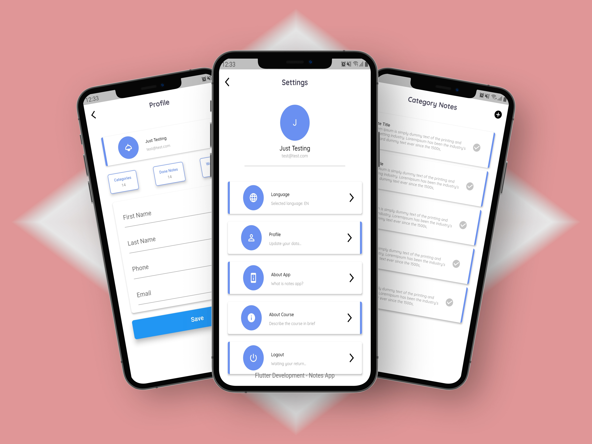
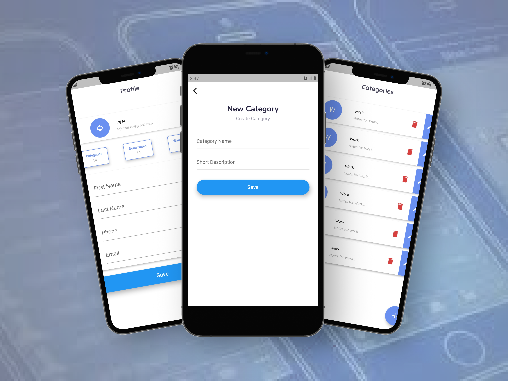
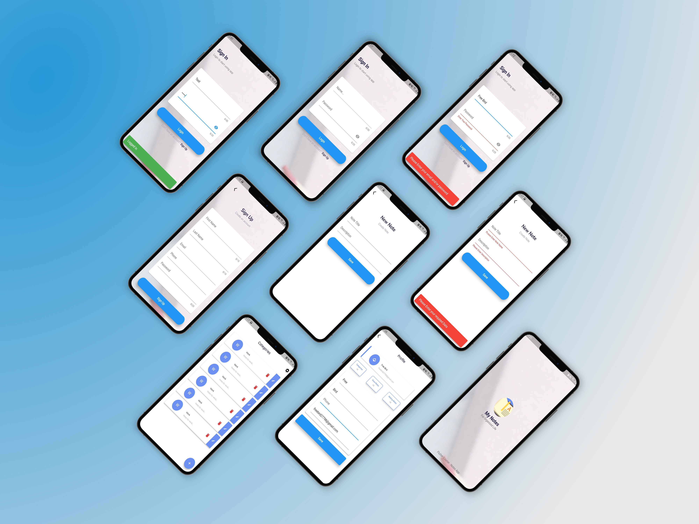
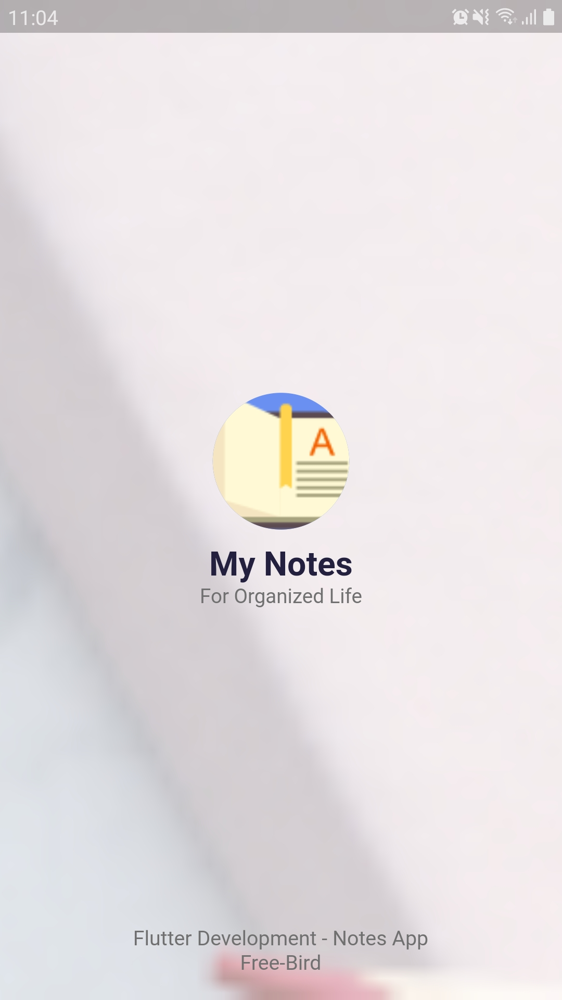
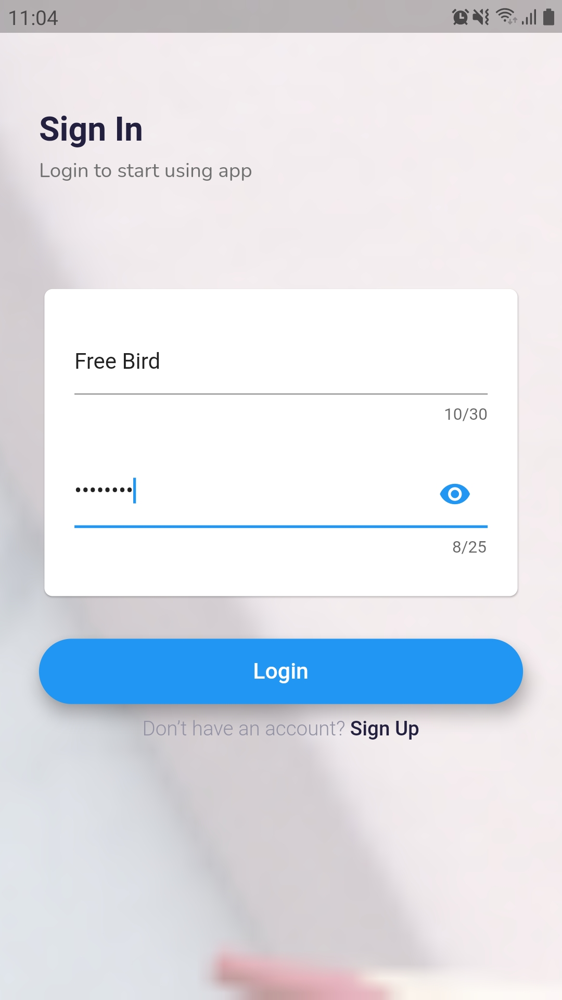
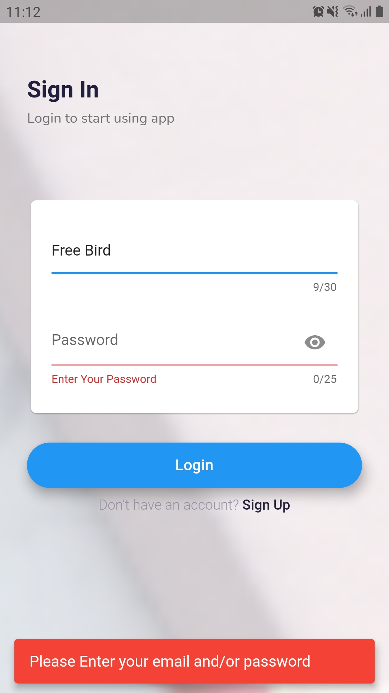
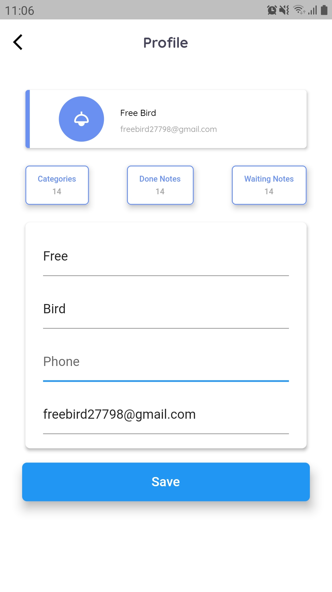
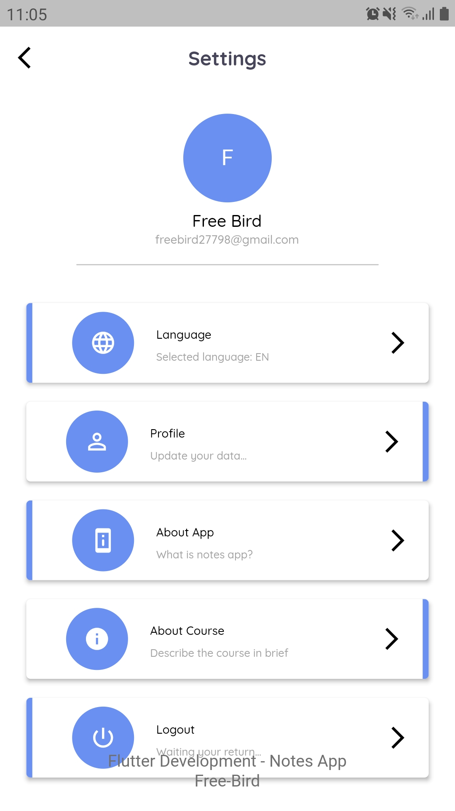

# Notes App UI 📝

A modern, clean, and minimalist **Notes App UI** built with **Flutter**. This project focuses on providing a high-quality user experience and a sleek interface for organizing thoughts and tasks.

## ✨ UI Features
- **Sleek Note Editor:** A beautiful interface for writing and viewing notes.
- **Category Management:** Organized UI for creating and managing different note categories.
- **Smart Categorization:** Visual elements designed to help users sort notes efficiently.
- **Modern Design:** Uses Material Design principles with a focus on typography and spacing.

## 🛠️ Tech Stack
- **Framework:** Flutter (Dart)
- **IDE:** Android Studio
- **Focus:** UI/UX Design & Custom Widgets

---

## 📸 Screenshots

### 🌟 Design Showcase (Mockups)

  
  
  

  
<b>🔍 View Application Screens (5 Screens)</b>

   
  

    
    
    
    
    
  

---

## 🛠️ Installation
1. Clone the repository.
2. Run `flutter pub get`.
3. Launch on your emulator or physical device to explore the UI.
